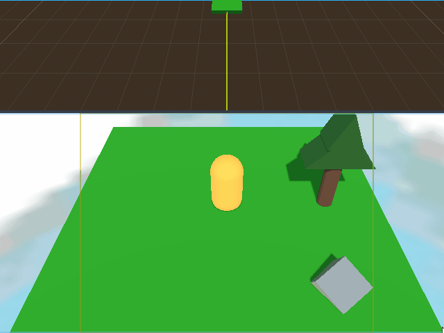
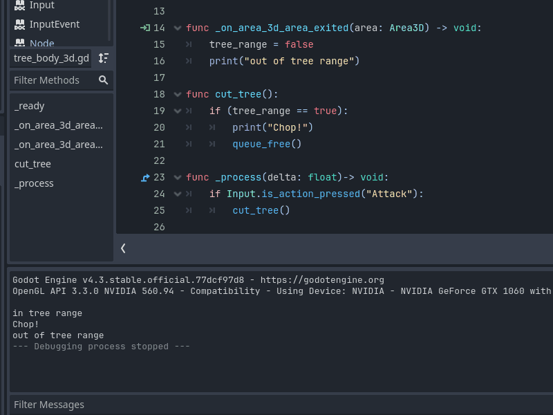

# Hello World!

Every journey starts with a single step.
## Making the first 2D Game Project - Squash The Creeps 2D
1. Upload the scene in my-first-game.
2. Created my-first-script with a rotating 2D object. The script rotates the icon around, and the rotation is independent to the frametrate.

3. TAKE CONTROL! Added left-right arrow for directional controls and up arrow for forward movement.

4. [Distant signals.](https://youtu.be/9fl58muc7SE?si=T0CmOZRPSwnf5zuD) Added a button sending a signal that turns the icon's visibility property on and off. (and lowered GIF resolution from 800x600 to 640x480)

5. Created my-first-2d-game: implementing character sprites, animations, collissions.
6. Created mobs and set game rules such as game-over upon hit, time-based score system. The system is WIP, but the game runs!

7. Implemented HUD with cool text.

**8. Completed my first 2D game project!** I added background color, sound effects, and linked everything together.

<video controls="" width="800" height="500" muted="" loop="" autoplay="">
<source src="https://github.com/HandrewOltenish/Godot_Projects/blob/main/my-first-2d-game/my-first-2d-game_video.mp4" type="video/mp4">
</video>

## Making the first 3D Game Project - Squash The Creeps 3D
9. Created the 3D project "Squash the Creeps 3D". Look at that crispy lighting!

10. Created collision sphere for the player body, and mapped the keys for controlling the player.

11. Gave directional movement to the Player. 8 whole directions. So many options!

12. Designed the mobs with random spawnng points, speeds, and going towards the player at a random angle. Can't wait to spawn them!

13. Added mob spawn script. Now they spawn at a a random interval on a pre-determined path. Currently they boop and stack in the scene.

14. Modified the ground, mob, and player physical intercations (layers + masks) so mobs don't collide with each other. Vroom!

15. Worked on collisions and squash mechanic. Now the player squashes the mob it's over the mob at about 90 degree angle

16. Improved object collision, mobs only change x and z directions, and now player dies when is on the floor and colliding directly with mobs

**17. Completed my first 3D Project! Added UI, player and mob animations, scaled the speed when they are moving, fixed jumping and falling velocity.**

18. Uploaded Treearock Game Design Document.
## Learning GDScript from Zero
20. Lesson 1 to 3. Learned about the proper way to call functions, parameters, radians, and coordinates.
21. Lesson 4. Played with a turtle-function and gave it instructions to draw corners, and a square.
22. Lesson 5. Created functions, and function parameters to draw corners, and rectangles of varying sizes and degrees.
23. Lesson 6 to 9. Function parameters, variables, sub-variables. I have used this in C before with structure, in C++ with objects. They are similar.
24. Lesson 10 to 15. Function-wide variables, script-wide variables, 2D Vector implementation, and conditions.
25. Lesson 16 to 17. Learned about while loops, and for loops. The creators of GDQuest recommend favoring the for loop over the while loop when developing games. The reasoning behind this being that while loop can be infinite, making the game unstable and hard to debug. The for loop has a finite number of steps and is frendlier. I would start implementing the while loop first, as I have previous experience from programming it in C.
26. Lesson 18 to 19 Learned the cool arrays, and all their uses. The array is a variable, so a WHOLE array can be used as a parameter. You can select units, draw paths, and draw a lot of shapes at the same time. This could be useful to draw a map for a 2D game, or a texture for a 3D object.
27. Lesson 20: What are strings, but a miserable pile of characters! In this lesson, I tell you, you can use strings to note animation names and play them with select functions. Totally tubular.
28. Lesson 21: RETURN values finally!
29. Lesson 22: Appending and popping values from array. This one was a real doozy. The logic is simple to understand, but hard to code at first. Having images is really helpful.
30. Lesson 23: Accessing values in array: This lesson is really fun. Aligning tracks and inventory items. The syntax is just like C here.
31. Read through Godot documentation of 2D and 3D rendering, system requirements, and Best Practices. Godot has an interesting feature where engine scripts are executed faster than manual custom scripts. This is because custom scripts need more backend calls to be accessed and run by the engine. (I will resume the lessons tomorrow when I have access to my computer again. The mobile site of GDQuest will not allow me to type in order to complete the lessons.)
32. Lesson 24: Creating dictionaries. These look like database elements. They are cool because you can use them to add, remove, and increase the value of items in a player's inventory, for example. Each dictionary has a key, and a value attached to the key. The key must be unique, as the dictionary hashes the values to the keys into an array index. Therefore, if you have the same value twice, there will be an error. The error will say you have a duplicate value. Under the hood, the computer has an error because it assigns 2 values to the same array index.
33. Lesson 25: Looping over dictionaries. This is a really cool thing as it allows you to create grid-based inventories using 2D Vector coordinates
34. Lesson 26: Value types. This is an essential thing to master. Even with my previous C practice it was weird wrapping my head around it. Also GDScript is a simple programming language, and it hides the types from view for the sake of simplicity. This does not help if you are a beginner, or if you are really tired.
35. Read Godot documentation about autoloaders. The difference between them and singleton is the autoloaders are executed on a Node level. Compared to singletons, autoloaders are easier to debug. How? Singletons act globally, and that means every script can access a singleton function. This means that debugging spans on the ENTIRE PROJECT. Autoloader functions act on a Node level, which means every bug with the autoloader can be investigated within that Node.
36. Learned that Nodes are not the one-size-fits-all. Depending on size, projects can have thousands of nodes with their own object. Nodes consume a lot of resources. It is something noticeable even in snall 2D games. I have about 6 nodes in Dodge The Creeps 2D and the size of the game is +80 MB. For a simple 2D game it is A LOT. The Documentation advises in using objects, RefSize, TreeList- generally the smallest parts. Objects also demand manual memory manipulation which gives more control and memory efficiency, leading to fewer errors.
37. Learned about best practices about Godot Interfaces: when you need a script that relies on other objects for features. There are two parts to go about the process: the first one is to create a reference that points to the object, and the second one to access the data or logic from the object.
38. Lesson 27: Type hints! GDscript is a simple language. For simplicity, the script assumes types when you declare values. Pros? Fast typing. Cons? It gets harder to read and understand the code the bigger it gets. Two weeks in, or two months in you won't know what you typed. This is where type hints come to: you hint a type, and then the computer sets the value to that specific type. Let's say you declare variable var health = 100. Computer assumes it's an int with value 100. Cool. But I want it to be float, so I can type var health: float = 100.0 . You tell the computer "Maybe set this value as a float *wink wink* ". You can also use GDScript's type inference, and type it like this var health := float 100.0 . It will do its best to set the type to the one after the := sign. Overall this type hinting is good because it helps you learn the types, it organises code better, is more debugger-friendly, and easier for your brain when you read it after two months, or when you are tired.
    == END OF THE COURSE: LEARNING GSCRIPT FROM ZERO ==
## Trearock
39. Restructured Treearock Game Design Document. Now it has a proper summary, and descriptions. Next step is updating it with all necessary tools.
40. Added the tools necessary (Godot 4.3 for programming, Blender for 3D assets, Paint for 2D assets). Added the Concept, gameplay overview and theme interpretation. 
41. Wrote the basics of the Art, and Audo sections in the Game Design Document containing crude ideas about the direction of the game.
42. Completed the Basic Game Design Document. Starting Development Timeline. I will continue updating the Development Timeline from within the GDD with the necessary milestones until I complete the **Minimum Viable Product**.
43. Added and working on the first Milestone - **Basic Environment**. I should have a platform acting as ground, a tree, a rock, and a player character, all with interactions by **01 April 2025**. I need to make a plan, a documentation with each step in the process. This way it will be easier to follow, and re-do the game if I hit a dead end.
44. Created the scene with Player, Ground, Tree , and Rock. The scene has global illumination, shadows and a skybox. All objects have physics and collisions. In the next day I will create the interaction between Player and Tree.

45. Interaction created. There is a function not working. It is supposed to remove the "TreeNode" node when the Player is close to the tree and presses Left Click on the tree.
46. Working on get_node function. It should get the Node itself so I can modify, or delete it ingame. For example, the player clicks a tree, the tree disappears.
47. Apparently I can use just the remove_child() / queue_free() function to remove the tree / remove the tree + free memory. The problem is, even when testing with player node, the event does not trigger.
48. Separated the Nodes. Instead of one Scene containing a Node3D containing everything, now there are separate scenes for Player, Tree, Rock, and World. This makes it easier to work out connections.
49. Currently pursuing two strategies for player interactions: Area3D collision, and RayCast3D.
50. I am away from home this weekend, so I'm working on Treearock Mobile version. The player object, tree object, and ground object are added. RayCast3D is added. I am currently working on implementing touch screen controls for Android, and then implementing signals connected to RayCast3D to aid with interactions between the player and the environment.
51. The signal works, and the tree now disappears when mouse cursor enters the tree's 3D area. Currently debugging on why Input.is_action_just_pressed("Attack) does not detect the Left Mouse clicked, which was mapped for "Attack".
52. Left mouse click still not detected. Will verify ALL control nodes and key mappings to see what is going on.
53. Did not verify control node. Verifying Input class and debugging only that.
54. Currently there is an issue the function. The tree dissappears when "Attack" is pressed, however the behavior needs to be consistent.
55. Changed the approach: the input was detected on a singular frame, hence the inconsistend behavior. I opted for a variable to check whether player is in range, and pressing attack in order to cut the tree and make it disappear.

56. I am away from home this weekend, therefore I am working on the mobile version, implementing touch screen controls using InputEventOnScreenDrag and InputEventOnScreenTouch.
57. Created movement buttons. they strafe the olayer directionally. I plan to make the button interface more user-friendly and THEN implementing InputEvents.
58. Still on mobile version: implementing a simple camera rotation system that rotates the player model alongside it.
59. Working on camera movement. Implemented left-right view. Next step is to rotate the character model accordingly.
60. Working on fixing an error where CharacterBody3D's rotation values can not be modified.
61. Added camera rotation around Y axis on PC. It is connected to the player model, so it follows it when the model is moving. I observed on the Mobile version of Treearock that in order to fully control camera attributes from the CharacterBody3D Script, the Camera3D *must* be added as a child node inside the Character3D Scene itself, not anywhere else.
62. Simplified the code; leaving only Up/Down movement, and left/right camera rotation. Velocity needs fixing, as the player is launched off the map when starting the game.
63. Worked on velocity, now pressing "Move Up" moves downards, and gravity makes the player float down.
64. Player now moves towards where the camera is pointing towards. Great success!

65. Discovered that when pressing "Move Left" or "Move Right" the camera rotates, and the player strafes left/right. This causes problems, as the player must rotate on the spot. Working on fix.
66. Debugging velocity. The player still strafes left/right. The logic behind my fix is to counteract this strafe with its negative amount. This way it cancels out, and the character rotates in place.
67. Debugged CameraDir. Now the player rotates in place without strafing, but it does not go forward.
68. Debugging velocity. The player does not move forward or backward, but the camera rotates.
69. Away from home, so working on mobile version. The behavior is the same, I am working on cancelling the velocity when pressing Left/Right
70. At home. Basic interactions with the rock. The objective is to split the rock in two poligons when pressing "Attack". The first step is to manipulate the transform property. Currently the system does not detect the "transform" property so I am using the "basis" property.
71. Fixed player movement. Player moves forward/backward and the player rotates in place along with the camera view.

72. Worked on the RockBody3D script. Intended result was to increase Y position of RockBody3D for every click. The unexpected result is that the TreeBody3D and RockBody3D scripts do not work as intended. Only _on_body_area_3d is detected.
73. Worked on fixing signals for tree chopping. Area3D signals are getting out of scope for my game.
74. Fixed the signals for tree chopping. Now I have the signal logic in place.
75. Removed Area3D nodes from Player, Tree, and Rock. Added RayCast3D and debugged interactions.
76. RayCast3D detects the collisions. The logic I am following is RayCast3D collides with Body -> a signal is sent to the specific RID of that body -> an interaction is executed. There can be a matrix that stores all the interactions available, but for now I work with what I have.
77. Since RayCast3D.get_collision() returned the CollisionObject3D of the TreeBody3D Node, I assumed its properties could be accessed by using the method queue_free() on the value returned by get_collission(). I was wrong, as the call referenced to a null instance. It seems that anything to do with the TreeBody3D object must be done from the TreeBody3D object script itself.
78. Worked on the mobile version of the game. Rotating RayCast3D has an error with invalid call, and rotating PlayerCharacter3D around Y axis makes the character move like the wheel of a train.